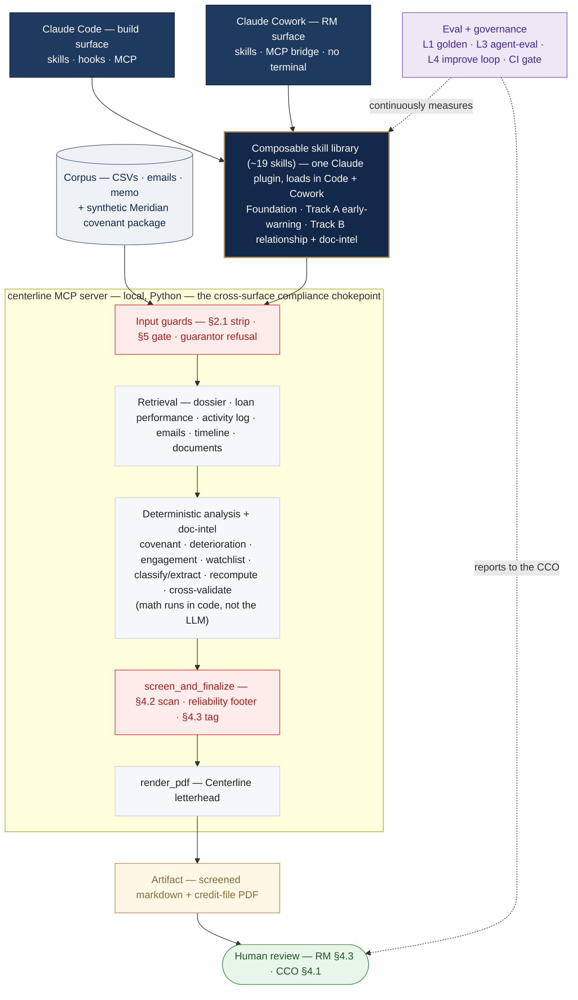

# Centerline Claude Pilot

A Forward-Deployed-Engineer pilot: a composable **Claude skill library** that drives AI adoption in the
Commercial Banking division of *Centerline Bank* (a fictional bank) — built to be **useful to relationship
managers, compliant with the bank's AI policy, and good enough to go into a credit file.**

> **All data in this repo is synthetic / fictional.** No real borrowers, no real credentials, nothing
> organization-internal. It's an engagement/interview artifact.

---

## The scenario
Centerline has Claude for Work licenses and nothing deployed. **Three relationship managers (RMs)** manage a
combined **$350M portfolio** and spend **30–40% of their time** on documentation, covenant tracking, and call
prep. One RM ("Tom") rebuilt his own workflows in *personal* ChatGPT — a compliance violation. The job: build
**Claude-native** workflows RMs will actually use, that **stay inside the bank's AI policy** and produce
trustworthy, source-grounded output.

The data: five borrowers (Meridian Fabrication, BlueLine Logistics, Crestwood Capital, Summit Retail, Arcadia
Property) across three RMs — structured CSVs (portfolio, monthly loan performance, CRM activity log), four
email threads, one full relationship-review memo, RM personas, Tom's shadow-workflow notes, and the AI
compliance policy.

## The two deliverables — built as two demo "tracks"
- **Track A — Portfolio Risk & Early-Warning** *(the compliant rebuild of Tom's weekly portfolio-summary
  workflow)*. Deterministic covenant/deterioration flags + a novel engagement-gap signal. RM-private; the
  automated-monitoring piece is "designed, pending compliance approval."
- **Track B — Relationship Review & Renewal Prep + Document-Intelligence** *(the capability we found by
  reading the data)*. Meeting prep, covenant-package intake, cross-source reconciliation / "close-the-loop,"
  relationship memos, and client communications — one demo prompt per RM. **All five of Tom's shadow workflows
  are rebuilt compliantly and live across the two tracks.**

## What reading the data revealed (the creative core)
- **Engagement diverges from distress** — a distressed borrower went **78 days** without substantive contact
  *while in breach*; a risk no single field flags.
- **Close-the-loop** — a relationship memo laid out an action plan (deadlines, a revolver cap, a watchlist
  trigger) that was **never executed**; the risk lives in the gap between the RM's stated intent and the
  data's drift.
- **System-of-record is unreliable in three ways** — wrong timestamps (a mis-dated/conflated log entry),
  the wrong monitoring lens (a construction loan's metrics are zero by design, so operating-covenant
  monitoring is blind), and missing decisions (a credit officer's guidance living only in email).
- **Retention radar** — the very borrower whose pristine, *improving* financials make him invisible to
  risk-monitoring is the one quietly shopping his renewal elsewhere.

## Architecture
A **library of small, composable skills** (one capability each), composed into the two tracks — not monolithic
workflows. Built in **Claude Code**, demoed in **Claude Cowork** ("Work in a folder"). Outputs are **file
artifacts**. Retrieval is via a **local MCP server** over the data corpus.



*The model **orchestrates and narrates**; the MCP tools **do the math and enforce compliance** — so §2.1/§4.2 hold regardless of what the model says, on both surfaces. Every output routes through `screen_and_finalize` to a human.*

- **Foundation / guardrail skills** (shared): source-grounding, a deterministic reliability footer,
  restricted-field redaction, output screening, client-360, communications drafting, CRM enrichment.
- **Track A skills**: covenant compliance, financial-trend analysis, deterioration signals (lifecycle-aware),
  engagement coverage, watchlist triage.
- **Track B skills**: open-items, cross-source discrepancy (incl. dates), commitment-fulfillment
  ("close-the-loop"), since-last-review diffing, external industry signals, meeting briefs, renewal/retention
  flag, relationship-review memo, and the document-intelligence cluster (classify / extract / completeness /
  quality / cross-validate).
- **Sub-agents** (only for fan-out or scheduled work): a covenant-package reviewer and a portfolio
  early-warning sweep.
- **MCP server + hooks**: the local `centerline` MCP server and deterministic hooks enforce compliance
  centrally.
- **Packaging — one source, both surfaces**: the skill library ships as a single **plugin** that loads in
  **Claude Code** (`--plugin-dir`) and **Claude Cowork** (upload), and the MCP server is **bridged into
  Cowork** — so the same compliant workflows run on the engineer's surface and the RM's no-terminal surface.

## Compliance, designed in (not disclaimers)
- **Restricted inputs** — internal ratings, watchlist, Special-Assets status, and guarantor personal
  financials are never sent to the model (stripped server-side); guarantor documents are refused.
- **No credit-adjacent language** — the AI states facts and organizes/drafts around an **RM-authored**
  assessment; it never characterizes creditworthiness. When surfacing a human's credit decision it acts as a
  **scribe** (verbatim, attributed), never paraphrasing into risk language.
- **Prohibited borrowers** — no AI processing for Special-Assets/litigation borrowers (a hard gate).
- **Human review** — borrower-facing and credit-file content requires RM review; CRM enrichment is proposed
  only, written after approval.
- **Monitoring** — automated alerting is presented as designed and pending compliance sign-off.
- **Trust** — every claim is cited to a source; the math is deterministic; each artifact carries a
  qualitative reliability footer (never a numeric "confidence %").

See [`CLAUDE.md`](./CLAUDE.md) for the always-on rules Claude follows in this repo.

## The 1-hour demo (build in Code → run in Cowork)
1. **Frame** the problem and the approach.
2. **Track A** — *"who needs attention this week?"* → *"is this borrower compliant — cushion + trend?"* →
   *"who've I gone quiet on?"* — ending on the honest point that **a flag is not an action**.
3. **Track B** — one prompt per RM: meeting prep + retention; covenant-package intake + missing-docs email;
   reconciliation + close-the-loop + a draw-response letter; and an annual relationship memo that assembles
   the 80% and pauses for the RM's judgment.
4. **Honest evaluation** (what works / the hard 20%).
5. **System, compliance, adoption, Q&A.**

## Repo layout (scaffolded incrementally)
```
.
├── CLAUDE.md                     # always-on project rules (compliance, data, conventions)
├── .mcp.json                     # registers the local `centerline` MCP server
├── .claude/
│   ├── settings.json             # deterministic compliance hooks
│   ├── skills/<name>/SKILL.md     # the composable skill library
│   └── agents/<name>.md          # sub-agents (fan-out / scheduled only)
├── mcp/centerline_mcp/           # local stdio MCP server (+ compliance guards)
├── scripts/                      # shared deterministic math (e.g. ratio recompute)
├── .mcp.json                     # registers the local stdio `centerline` MCP server for Claude CODE
│                                  #   (Cowork does NOT read this — see docs/mcp_local_cowork.md)
├── data/                         # OPERATIONAL — the only content the MCP serves
│   ├── structured/               # 3 CSVs (portfolio, monthly performance, activity log)
│   ├── emails/                   # 4 threads
│   ├── memos/relationship-review/ # input relationship memo(s)
│   └── synthetic/                # synthetic covenant-package documents (Phase 3)
├── reference/                    # build guidance (policy, personas, shadow-workflows) — NOT served
└── evals/                        # eval cases per skill (authored before docs)
```

## Running the MCP server (Claude Code vs Claude Cowork)
The local `centerline` MCP server is **stdlib-only** (plain `python3`, nothing to install). **Claude Code**
loads it from the repo-root `.mcp.json`. **Claude Cowork** runs in a sandboxed VM and does **not** read
`.mcp.json` — you register the server in `~/Library/Application Support/Claude/claude_desktop_config.json`
and Claude Desktop SDK-bridges it into the VM (it appears as `type: sdk`). Full setup, the *why*, and the
gotchas (absolute paths, restart-and-new-task, the hooks caveat): **[`docs/mcp_local_cowork.md`](./docs/mcp_local_cowork.md)**.
To **verify Cowork is aligned with the repo** after any change (MCP present, skills load, hooks fire), use the
runbook in **[`cowork/`](./cowork/README.md)**.

## Build roadmap
Dependency-ordered phases; each keeps a **compliant, working spine** before adding reach. Cross-cutting
throughout: **evals authored before docs**, deterministic math, source-grounding, and **a separate commit per
increment**.

- **Phase 0 — Bootstrap ✅.** Repo, `.gitignore`, `README`, `CLAUDE.md`, first push; choose the MCP runtime.
  *Exit: `main` published with the baseline files.*
- **Phase 1 — Compliant spine ✅ (core + observability infra done).** Local MCP retrieval over the corpus + central compliance guards
  (restricted-field strip, prohibited-borrower gate, guarantor-document refusal) + the foundation/guardrail
  skills (grounding, the reliability footer, redaction, output screening, client-360, communications, CRM
  enrichment) + the deterministic hooks + the **observability harness** (eval runner, a run-trace ledger via
  hooks, and a generated per-prompt report — all from real runs; no fabricated dashboards). *Exit: in Cowork,
  retrieve a borrower dossier with restricted fields stripped, every claim cited, the reliability footer
  attached, a guarantor document refused — and a trace ledger + per-prompt observability report produced.*
- **Phase 2 — Track A (Early-Warning) = Deliverable A ✅ (complete).**
  Deterministic covenant/trend/deterioration flags (lifecycle-aware), the engagement-gap signal, watchlist
  triage, and a portfolio-sweep sub-agent (narrated). *Exit met: the three Track-A prompts produce real,
  cited outputs ✅; the **"what changed & why" vs Tom's wf5** write-up ✅
  (`solutions/deliverable-a/what-changed-vs-wf5.md`); the **recipe** (verbatim A1/A2/A3 prompts + skill/MCP
  design) ✅ (`solutions/deliverable-a/recipe.md`); and the **eval/observability infra** ✅ — `evals/runner.py`
  + 81 source-grounded golden cases (`evals/cases/`, T1/T2 + negatives, all 5 borrowers) → `evals/results/latest.md`,
  `evals/observability.py` → `reports/observability.md` per-prompt scorecards, and the `run_evals` MCP tool
  (in-console on either surface).*
- **Phase 3 — Synthetic documents ⏳ (not started).** A realistic covenant package as **labeled synthetic PDFs** that encode
  facts already in the data (some deliberately incomplete or flawed), plus per-type extraction schemas.
  *Exit: package + schemas + cross-validation targets in place.*
- **Phase 4 — Track B (Relationship/Renewal + Doc-Intelligence) = Deliverable B ⏳ (not started).** Document
  classification/extraction/completeness/quality/cross-validation (+ a package-review sub-agent) and the
  relationship skills (open-items, close-the-loop, since-last-review diffing, industry signals, the
  renewal/retention flag, meeting briefs, and the decomposed relationship memo). *Exit: the four per-RM demo
  prompts run end-to-end — including the restricted-document refusal, scribe-not-author surfacing, and the
  memo's human-in-the-loop pause; all five rebuilt shadow workflows confirmed live.*
- **Phase 5 — Demo integration & dry-runs ⏳ (not started).** Wire the full one-hour flow, run it end-to-end in Cowork,
  capture real outputs, and write the honest evaluation (what works / the hard 20%). *Exit: a full dry-run
  within the hour, with outputs captured.*
- **Phase 6 — Packaging & production story ⏳ (not started).** Optional plugin packaging; the deployment, compliance-approval,
  and per-RM adoption narrative. *Exit: packaging and adoption story ready for Q&A.*

## Scope discipline (built vs designed)
The brief rewards **depth over breadth** and **honest evaluation**. So a focused **~15 skills are built to depth with evals** — the compliance/trust foundation, both Track-A and Track-B creative cores, and the per-RM rebuilds — while the broader library (the full per-type document-intelligence cluster, since-last-review diffing, the two sub-agents) is presented as **designed architecture**, clearly labeled built-vs-designed. **Both creative gems and the rebuilt early-warning run on real data**; the document-intelligence prompt is the one piece that runs on (clearly labeled) **synthetic** documents and is positioned as a supporting guardrail demonstration, not a creativity claim.

## Status
**Building — Phase 0–1 ✅, Phase 2 / Deliverable A ✅ COMPLETE (updated 2026-06-12).**

**Done & verified:** repo live; local MCP server with **11 tools** (borrower/loan/activity/email retrieval + `screen_and_finalize` §4.2 + Track-A `check_covenant_compliance` / `detect_deterioration_signals` / `measure_engagement_coverage` / `assemble_watchlist` + `run_evals` + `get_latest_report` [git-pulls then returns the latest eval/improvement report — always-latest, cross-surface]), with §2.1 strip / §5 gate / guarantor refusal enforced server-side; **14 plugin skills** (incl. `running-the-eval-suite` + display-only `viewing-eval-results` / `viewing-proposed-improvements`); a Code-side run-ledger hook; **46 deterministic tests**; **verified end-to-end in Claude Code *and* Cowork** (watchlist ranking, covenant + status-mislabel, the 78-day engagement gap, §4.2 blocking). **Deliverable A complete:** the *"what changed & why vs Tom's wf5"* write-up (5 violations→fixes incl. the deterministic-tools-over-CSV point, architecture verdict, captured outputs, honest 80/20), the **recipe** (verbatim A1/A2/A3 prompts + skill/MCP design), and the **eval/observability infra** — `evals/runner.py` + **81 source-grounded golden cases** (T1/T2 + negatives across all 5 borrowers) → `evals/results/latest.md`, `evals/observability.py` → `reports/observability.md` per-prompt scorecards, and the **`run_evals` MCP tool** (run the suite in-console on either surface) — **81/81 + 46/46 passing**. A separate **agent-behavior eval** (`evals/agent_eval.py`) runs the demo prompts through **Claude Code headless** and grades the *model's* decisions — tool selection, §4.2 on its own narration, fact faithfulness — with deterministic code (the unit tests check the tool logic; this checks the LLM-driven layer), and **captures each run's actual analysis text**. A **Layer-4 improvement loop** (`evals/improve.py` / the `eval-improve` workflow) reads the latest eval and writes **advisory** proposals for the skill library to `reports/improvements/` — *report-only, no auto-edits* (it can't touch guards/code/eval-cases), for a human to review (via the `viewing-proposed-improvements` skill) and apply by hand. See [`docs/evals_and_observability.md`](./docs/evals_and_observability.md).

**Next:** **Phase 3** (the synthetic Meridian covenant package) → **Phase 4: Track B = Deliverable B** → Phase 5 demo integration → Phase 6 packaging.
