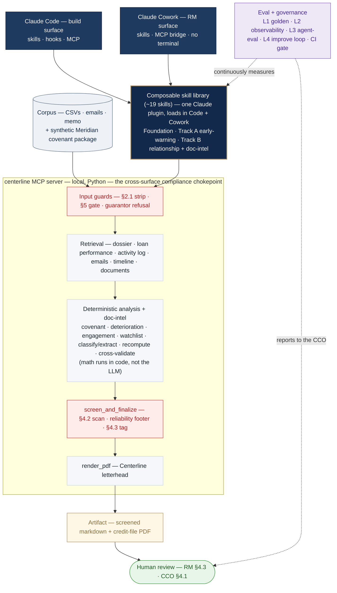

# Centerline Claude Pilot

A Forward-Deployed-Engineer pilot: a composable **Claude skill library** that drives AI adoption in the
Commercial Banking division of *Centerline Bank* (a fictional bank) — built to be **useful to relationship
managers, compliant with the bank's AI policy, and good enough to go into a credit file.**

> **All data in this repo is synthetic / fictional.** No real borrowers, no real credentials, nothing
> organization-internal. It's an engagement/interview artifact.

---

## The scenario
Centerline has Claude for Work licenses and nothing deployed. **Three relationship managers (RMs)** manage a
combined **$350M portfolio** and spend **30–40% of their time** on documentation, covenant tracking, and call
prep. One RM ("Tom") rebuilt his own workflows in *personal* ChatGPT — a compliance violation. The job: build
**Claude-native** workflows RMs will actually use, that **stay inside the bank's AI policy** and produce
trustworthy, source-grounded output.

The data: five borrowers (Meridian Fabrication, BlueLine Logistics, Crestwood Capital, Summit Retail, Arcadia
Property) across three RMs — structured CSVs (portfolio, monthly loan performance, CRM activity log), four
email threads, one full relationship-review memo, RM personas, Tom's shadow-workflow notes, and the AI
compliance policy.

## The two deliverables — built as two demo "tracks"
- **Track A — Portfolio Risk & Early-Warning** *(the compliant rebuild of Tom's weekly portfolio-summary
  workflow)*. Deterministic covenant/deterioration flags + a novel engagement-gap signal. RM-private; the
  automated-monitoring piece is "designed, pending compliance approval."
- **Track B — Relationship Review & Renewal Prep + Document-Intelligence** *(the capability we found by
  reading the data)*. Meeting prep, covenant-package intake, cross-source reconciliation / "close-the-loop,"
  relationship memos, and client communications — one demo prompt per RM. **All five of Tom's shadow workflows
  are rebuilt compliantly and live across the two tracks.**

## What reading the data revealed (the creative core)
- **Engagement diverges from distress** — a distressed borrower went **78 days** without substantive contact
  *while in breach*; a risk no single field flags.
- **Close-the-loop** — a relationship memo laid out an action plan (deadlines, a revolver cap, a watchlist
  trigger) that was **never executed**; the risk lives in the gap between the RM's stated intent and the
  data's drift.
- **System-of-record is unreliable in three ways** — wrong timestamps (a mis-dated/conflated log entry),
  the wrong monitoring lens (a construction loan's metrics are zero by design, so operating-covenant
  monitoring is blind), and missing decisions (a credit officer's guidance living only in email).
- **Retention radar** — the very borrower whose pristine, *improving* financials make him invisible to
  risk-monitoring is the one quietly shopping his renewal elsewhere.

## Architecture
A **library of small, composable skills** (one capability each), composed into the two tracks — not monolithic
workflows. Built in **Claude Code**, demoed in **Claude Cowork** ("Work in a folder"). Outputs are **file
artifacts**. Retrieval is via a **local MCP server** over the data corpus.



*The model **orchestrates and narrates**; the MCP tools **do the math and enforce compliance** — so §2.1/§4.2 hold regardless of what the model says, on both surfaces. Every output routes through `screen_and_finalize` to a human.*

- **Foundation / guardrail skills** (shared): source-grounding, a deterministic reliability footer,
  restricted-field redaction, output screening, client-360, communications drafting, CRM enrichment.
- **Track A skills**: covenant compliance, financial-trend analysis, deterioration signals (lifecycle-aware),
  engagement coverage, watchlist triage.
- **Track B skills**: open-items, cross-source discrepancy (incl. dates), commitment-fulfillment
  ("close-the-loop"), since-last-review diffing, external industry signals, meeting briefs, renewal/retention
  flag, relationship-review memo, and the document-intelligence cluster (classify / extract / completeness /
  quality / cross-validate).
- **Sub-agents** (only for fan-out or scheduled work): a covenant-package reviewer and a portfolio
  early-warning sweep.
- **Where enforcement lives**: the local `centerline` MCP server (plus `core.py`) is the **cross-surface
  compliance chokepoint** — it runs in both Claude Code and Cowork, so §2.1/§4.2 hold regardless of what the
  model says. Deterministic hooks add a **Code-only** redundant belt (they don't fire in Cowork — the server
  is what's relied on).
- **Packaging — one source, both surfaces**: the skill library ships as a single **plugin** that loads in
  **Claude Code** (`--plugin-dir`) and **Claude Cowork** (upload), and the MCP server is **bridged into
  Cowork** — so the same compliant workflows run on the engineer's surface and the RM's no-terminal surface.

## MCP server tools (19)
Everything the model can do against the bank's data goes through these tools — **the model orchestrates and
narrates; the tools do the math and enforce compliance.** Every retrieval tool strips the internal rating
(§2.1), redacts watchlist/Special-Assets language, and halts Special-Assets/litigation borrowers (§5); the
analysis tools are **deterministic** (the math is never the LLM's).

**Retrieval — read the system of record**
- `get_borrower_dossier` — profile + latest performance + memo presence (rating stripped; `covenant_status` kept as a fact).
- `get_loan_performance` — monthly DSCR / leverage / revolver / status rows; restricted note language redacted.
- `get_activity_log` — the CRM contact log.
- `get_emails` — the borrower's email thread.
- `get_relationship_timeline` — merges the CRM log + emails into one **source-tagged, chronological** timeline so mis-dated/conflated entries and email-only decisions surface (powers B3 reconciliation).
- `list_documents` — enumerate a covenant-package directory **host-side** (no Cowork folder-access prompt).

**Track-A analysis — deterministic, facts-only (§4.2)**
- `check_covenant_compliance` — DSCR/leverage vs thresholds, cushion, breach flags, reported-vs-computed status (construction → N/A).
- `detect_deterioration_signals` — trends, threshold crossings, the **status-vs-trend mislabel**, thin cushion, construction lifecycle (pre-leasing vs 75%).
- `measure_engagement_coverage` — days since the last **substantive two-way** contact (one-way notices / missed calls don't count) vs the naive count.
- `assemble_watchlist` — composes the three above across the book, ranked by **risk × neglect** (a facts-derived order, not a credit rating; §4.1 for automation).
- `flag_renewal_and_retention` — the **inverse radar**: fires on a *healthy* borrower approaching renewal / being courted by a competitor; surfaces facts + "engage," **never a rate**.

**Document intelligence — the synthetic covenant package**
- `classify_document` — type a package PDF; the **§2.1 pre-screen refuses a guarantor PFS before any model call**.
- `extract_document_fields` — per-type schema extraction (skips `other` / PO / projections; refuses guarantor).
- `cross_validate_covenant` — certified vs **recomputed (GAAP)** vs the bank's own data, with the **EBITDA add-back bridge**; every figure provenance-tagged; returns `cross_source_mismatches` for an honest footer.
- `review_package` — completeness (missing docs / outstanding items) + quality flags (unsigned letter, withheld names) + §2.1 refusals; returns `low_confidence_inputs` for the footer.

**Compliance & output**
- `screen_and_finalize` — the **cross-surface OUTPUT guard**: scans for §4.2 credit language (blocks), attaches the qualitative reliability footer (**never a %**), tags §4.3 review. Every artifact routes through it.
- `render_pdf` — render a screened artifact to a **credit-file-grade PDF** (Centerline letterhead), preserving the DRAFT banner + footer; optional trend charts.

**Eval & governance**
- `run_evals` — run the deterministic **golden suite** against the live tool logic and refresh the observability scorecard (no LLM in the grader).
- `get_latest_report` — read-only `git pull` + return the latest **eval / improvement / observability** report (always-current, cross-surface).

## Compliance, designed in (not disclaimers)
- **Restricted inputs** — internal ratings, watchlist, Special-Assets status, and guarantor personal
  financials are never sent to the model (stripped server-side); guarantor documents are refused.
- **No credit-adjacent language** — the AI states facts and organizes/drafts around an **RM-authored**
  assessment; it never characterizes creditworthiness. When surfacing a human's credit decision it acts as a
  **scribe** (verbatim, attributed), never paraphrasing into risk language.
- **Prohibited borrowers** — no AI processing for Special-Assets/litigation borrowers (a hard gate).
- **Human review** — borrower-facing and credit-file content requires RM review; CRM enrichment is proposed
  only, written after approval.
- **Monitoring** — automated alerting is presented as designed and pending compliance sign-off.
- **Trust** — every claim is cited to a source; the math is deterministic; each artifact carries a
  qualitative reliability footer (never a numeric "confidence %").

See [`CLAUDE.md`](./CLAUDE.md) for the always-on rules Claude follows in this repo.

## The 1-hour demo (build in Code → run in Cowork)
1. **Frame** the problem and the approach.
2. **Track A** — *"who needs attention this week?"* → *"is this borrower compliant — cushion + trend?"* →
   *"who've I gone quiet on?"* — ending on the honest point that **a flag is not an action**.
3. **Track B** — one prompt per RM: meeting prep + retention; covenant-package intake + missing-docs email;
   reconciliation + close-the-loop + a draw-response letter; and an annual relationship memo that assembles
   the 80% and pauses for the RM's judgment.
4. **Honest evaluation** (what works / the hard 20%).
5. **System, compliance, adoption, Q&A.**

## Presentation & presenter materials
The panel deck and prep live under [`presentation/`](./presentation/):
- **[`slides/centerline-claude-pilot.md`](./presentation/slides/centerline-claude-pilot.md)** — the 25-slide
  **Marp** deck (renders to PDF); Centerline theme in `slides/themes/`, architecture diagram in
  `slides/diagrams/`.
- **[`speaker-notes.md`](./presentation/speaker-notes.md)** — the tight spoken script, per slide.
- **[`panel-qa-prep.md`](./presentation/panel-qa-prep.md)** — per-slide *Land* + likely Q&A / gotchas + the
  hardest questions.
- **[`slide-deep-dive.md`](./presentation/slide-deep-dive.md)** — a thorough slide-by-slide reader (intent,
  facts to have cold, questions, landmines).

Render the deck:
```bash
npx -y @marp-team/marp-cli --theme-set presentation/slides/themes --pdf --allow-local-files \
  presentation/slides/centerline-claude-pilot.md -o presentation/slides/centerline-claude-pilot.pdf
```

## From pilot to production
The pilot runs on a local MCP server + Claude Code/Cowork. For a real deployment it **maps 1:1 onto
AWS-managed services** — not rebuilt, the same compliant design, hosted (Caylent's stack):
- **Bedrock AgentCore Gateway** — the local MCP becomes a managed MCP server with **least-privilege**
  execution roles, per-tool interceptors, and on-behalf-of identity (the agent acts only in the
  authenticated user's scope).
- **AgentCore Runtime** — serverless, **per-invocation microVM isolation**; skills deploy via the Claude
  Agent SDK.
- **AgentCore Observability** — OpenTelemetry → CloudWatch for token usage, latency, and errors.
- **Bedrock Guardrails** — restricted-field/PII redaction and denied-topic filtering as **defense-in-depth**.
  *Honest caveat: Guardrails is probabilistic and doesn't scan tool-call outputs — so our **deterministic
  server-side guards stay the primary chokepoint**.*

Production hardening: **query observability** (log + scan every query *and* response for non-compliant
language — not just the artifacts), **per-RM/skill token & spend budgets**, **sandboxed least-privilege
connectors**, **§4.1 monitoring** pending CCO sign-off, and **§2.3 residency** (local scheduled jobs over
cloud routines). Scheduled jobs **prepare proposals only — never auto-act** (§4.3).

## Repo layout (scaffolded incrementally)
```
.
├── CLAUDE.md                     # always-on project rules (compliance, data, conventions)
├── .mcp.json                     # registers the local stdio `centerline` MCP server for Claude CODE
│                                  #   (Cowork does NOT read this — see docs/mcp_local_cowork.md)
├── .claude/
│   ├── settings.json             # deterministic compliance hooks (Code-only belt)
│   ├── skills/<name>/SKILL.md     # the composable skill library
│   └── agents/<name>.md          # sub-agents (fan-out / scheduled only)
├── mcp/centerline_mcp/           # local stdio MCP server (+ compliance guards)
├── scripts/                      # shared deterministic math (e.g. ratio recompute)
├── presentation/                 # the panel deck (Marp) + presenter materials
├── data/                         # OPERATIONAL — the only content the MCP serves
│   ├── structured/               # 3 CSVs (portfolio, monthly performance, activity log)
│   ├── emails/                   # 4 threads
│   ├── memos/relationship-review/ # input relationship memo(s)
│   └── synthetic/                # synthetic covenant-package documents (Phase 3)
├── reference/                    # build guidance (policy, personas, shadow-workflows) — NOT served
└── evals/                        # eval cases per skill (authored before docs)
```

## Running the MCP server (Claude Code vs Claude Cowork)
The local `centerline` MCP server is **stdlib-only** (plain `python3`, nothing to install). **Claude Code**
loads it from the repo-root `.mcp.json`. **Claude Cowork** runs in a sandboxed VM and does **not** read
`.mcp.json` — you register the server in `~/Library/Application Support/Claude/claude_desktop_config.json`
and Claude Desktop SDK-bridges it into the VM (it appears as `type: sdk`). Full setup, the *why*, and the
gotchas (absolute paths, restart-and-new-task, the hooks caveat): **[`docs/mcp_local_cowork.md`](./docs/mcp_local_cowork.md)**.
To **verify Cowork is aligned with the repo** after any change (MCP present, skills load, hooks fire), use the
runbook in **[`cowork/`](./cowork/README.md)**.

## Build roadmap
Dependency-ordered phases; each keeps a **compliant, working spine** before adding reach. Cross-cutting
throughout: **evals authored before docs**, deterministic math, source-grounding, and **a separate commit per
increment**.

- **Phase 0 — Bootstrap ✅.** Repo, `.gitignore`, `README`, `CLAUDE.md`, first push; choose the MCP runtime.
  *Exit: `main` published with the baseline files.*
- **Phase 1 — Compliant spine ✅ (core + observability infra done).** Local MCP retrieval over the corpus + central compliance guards
  (restricted-field strip, prohibited-borrower gate, guarantor-document refusal) + the foundation/guardrail
  skills (grounding, the reliability footer, redaction, output screening, client-360, communications, CRM
  enrichment) + the deterministic hooks + the **observability harness** (eval runner, a run-trace ledger via
  hooks, and a generated per-prompt report — all from real runs; no fabricated dashboards). *Exit: in Cowork,
  retrieve a borrower dossier with restricted fields stripped, every claim cited, the reliability footer
  attached, a guarantor document refused — and a trace ledger + per-prompt observability report produced.*
- **Phase 2 — Track A (Early-Warning) = Deliverable A ✅ (complete).**
  Deterministic covenant/trend/deterioration flags (lifecycle-aware), the engagement-gap signal, watchlist
  triage, and a portfolio-sweep sub-agent (narrated). *Exit met: the three Track-A prompts produce real,
  cited outputs ✅; the **"what changed & why" vs Tom's wf5** write-up ✅
  (`solutions/deliverable-a/what-changed-vs-wf5.md`); the **recipe** (verbatim A1/A2/A3 prompts + skill/MCP
  design) ✅ (`solutions/deliverable-a/recipe.md`); and the **eval/observability infra** ✅ — `evals/runner.py`
  + 81 source-grounded golden cases (`evals/cases/`, T1/T2 + negatives, all 5 borrowers) → `evals/results/latest.md`,
  `evals/observability.py` → `reports/observability.md` per-prompt scorecards, and the `run_evals` MCP tool
  (in-console on either surface).*
- **Phase 3 — Synthetic documents ✅ (done).** A realistic Meridian covenant package as **labeled synthetic PDFs** that encode
  facts already in the data (some deliberately incomplete or flawed: an unsigned rep letter, missing PO/AR
  names/projections, a planted guarantor PFS for the §2.1 refusal), per-type extraction schemas, and the
  doc-intel engine (classify / extract / recompute / cross-validate). *Exit met: package + schemas +
  cross-validation targets in place; the certified-vs-recomputed catch reconciles to the bank's own data.*
- **Phase 4 — Track B (Relationship/Renewal + Doc-Intelligence) = Deliverable B ✅ (complete).** Document
  classification/extraction/completeness/quality/cross-validation and the relationship skills (open-items,
  close-the-loop, renewal/retention flag, relationship-timeline reconciliation, and the decomposed
  relationship memo). *Exit met: the four per-RM demo prompts run end-to-end and are Cowork-verified —
  including the restricted-document refusal, scribe-not-author surfacing, and the memo's human-in-the-loop
  pause; all five rebuilt shadow workflows confirmed live.*
- **Phase 5 — Demo integration & dry-runs ✅ (deck built).** The full one-hour flow runs end-to-end in Cowork
  with real captured outputs and the honest evaluation written; the **25-slide panel deck + presenter
  materials** are built under [`presentation/`](./presentation/). *Exit met: a full dry-run within the hour,
  outputs captured, deck drafted.*
- **Phase 6 — Packaging & production story ✅ (done).** The library ships as **one plugin** that loads on both
  surfaces, and **Claude Cowork is fully configured** (see [How Claude Cowork is configured](#how-claude-cowork-is-configured)
  below). The deployment, compliance-approval, AWS-managed mapping, and per-RM adoption narrative are ready
  for Q&A (see [From pilot to production](#from-pilot-to-production)).

## How Claude Cowork is configured
Cowork runs the agent in a **sandboxed Linux VM** and does **not** read the repo's `.mcp.json` or `.claude/`,
so it's wired up three ways — once per run-surface concern:

1. **MCP tools → SDK bridge.** The `centerline` server is registered in
   `~/Library/Application Support/Claude/claude_desktop_config.json`; Claude Desktop **SDK-bridges** it into
   the VM (it appears as `type: sdk`). The server is spawned on the **host Mac** (via `uv run --with mcp`), so
   the same server serves both Code (`.mcp.json`) and Cowork (the bridge) — and the §2.1/§5 guards hold on both.
2. **Skills → uploaded plugin.** The skill library is installed by **uploading the plugin zip** (Customize →
   Personal plugins → Create/Upload). Cowork doesn't auto-discover the repo's `.claude/skills/`, so the plugin
   is the delivery vehicle.
3. **Data → "Work in a folder."** Cowork opens the repo via **Work in a folder**, reading the corpus directly;
   the MCP tools read the host files regardless.

**The one honest caveat:** project/plugin **hooks do not fire in Cowork** — which is exactly why compliance is
enforced in the **MCP server / `core.py`** (the cross-surface chokepoint), not in hooks. Full setup + gotchas:
**[`docs/mcp_local_cowork.md`](./docs/mcp_local_cowork.md)**; the alignment runbook: **[`cowork/`](./cowork/README.md)**.
